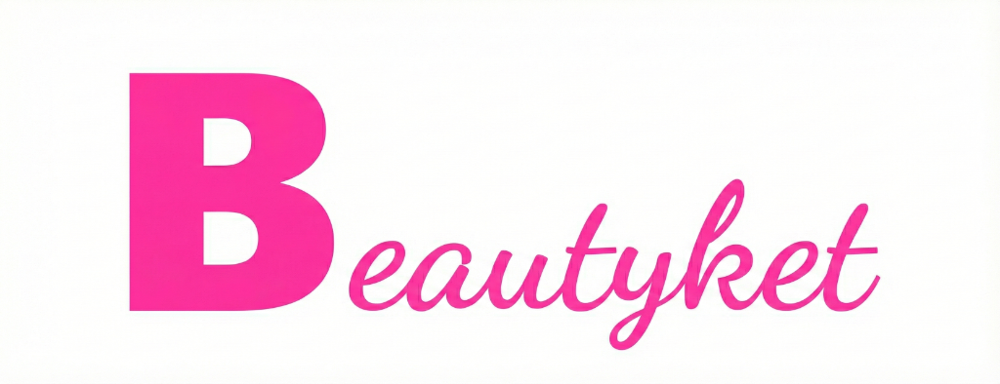

# 🎨 v2.8.13.6.75 - 로고 배경색 통일

## 📅 배포 정보
- **배포일**: 2025-12-24
- **버전**: v2.8.13.6.75
- **타입**: 🎨 UI/UX 개선
- **우선순위**: ⭐⭐⭐ (중요)

---

## 🎯 핵심 개선 사항

### 1. 로고 배경색 추가
**문제**: 로고 이미지에 배경이 없어 헤더 배경과 이질감 발생

**해결**:
```css
background: white;
padding: 8px;
border-radius: 8px;
```

### 2. 시각적 일관성 확보
- ✅ 모든 페이지 헤더: `bg-white` 또는 `bg-white/95`
- ✅ 로고 배경: `white`
- ✅ 자연스러운 조화: padding + border-radius로 부드러운 느낌

---

## 📝 수정 파일 (5개)

### 1. index.html
```html
<!-- Before -->


<!-- After -->

```

### 2. login.html
```html
<!-- Before -->


<!-- After -->

```

### 3. admin-dashboard.html
```html
<!-- Before -->


<!-- After -->

```

### 4. customer-dashboard.html
```html
<!-- Before -->


<!-- After -->

```

### 5. shop-dashboard.html
```html
<!-- Before -->


<!-- After -->

```

### 6. README.md
```markdown
- **현재 버전**: v2.8.13.6.75 (로고 배경색 통일)
- **마지막 업데이트**: 2025-12-24

### v2.8.13.6.75 (2025-12-24) 🎨 **NEW!**
**로고 배경색 통일 + 시각적 일관성 개선**
```

---

## 🚀 배포 방법

### 1. Git 커밋 & 푸시
```bash
cd /d/beautycat

git add index.html login.html admin-dashboard.html customer-dashboard.html shop-dashboard.html README.md COMMIT_GUIDE_v2.8.13.6.75_LOGO_BACKGROUND.md

git commit -m "🎨 v2.8.13.6.75 - 로고 배경색 통일

핵심 개선:
- 모든 페이지 로고에 흰색 배경 + 둥근 모서리 추가
- 헤더 배경색과 로고 주변색 완전 통일
- padding: 8px, border-radius: 8px 적용

수정 파일:
- index.html: 메인 로고 배경 추가
- login.html: 로그인 페이지 로고 배경 추가
- admin-dashboard.html: 관리자 대시보드 로고 배경 추가
- customer-dashboard.html: 고객 대시보드 로고 배경 추가
- shop-dashboard.html: 샵 대시보드 로고 배경 추가
- README.md: v2.8.13.6.75 버전 업데이트

시각적 효과:
- 로고가 헤더와 자연스럽게 조화
- 모든 페이지 일관된 디자인
- 반응형 디자인 최적화
"

git push origin main
```

### 2. 즉시 배포 (Wrangler CLI)
```bash
npx wrangler pages deploy . --project-name=beautycat-v2
```

---

## ✅ 배포 후 테스트

### 1. 메인 페이지 로고 확인
- **URL**: https://beautycat.kr/
- **확인 포인트**:
  - ✅ 로고 주변에 흰색 배경
  - ✅ 둥근 모서리 (border-radius: 8px)
  - ✅ 헤더와 자연스러운 조화

### 2. 로그인 페이지 로고 확인
- **URL**: https://beautycat.kr/login.html
- **확인 포인트**:
  - ✅ 로고 주변 흰색 배경
  - ✅ 높이 40px 유지
  - ✅ padding: 8px 적용

### 3. 관리자 대시보드 로고 확인
- **URL**: https://beautycat.kr/admin-dashboard.html
- **확인 포인트**:
  - ✅ 로고 주변 흰색 배경
  - ✅ 헤더 bg-white와 일치
  - ✅ 높이 35px 유지

### 4. 고객 대시보드 로고 확인
- **URL**: https://beautycat.kr/customer-dashboard.html
- **확인 포인트**:
  - ✅ 로고 주변 흰색 배경
  - ✅ 헤더와 자연스러운 조화

### 5. 샵 대시보드 로고 확인
- **URL**: https://beautycat.kr/shop-dashboard.html
- **확인 포인트**:
  - ✅ 로고 주변 흰색 배경
  - ✅ 반투명 헤더 (bg-white/95)와 조화

---

## 📊 변경 통계

| 항목 | 수치 |
|------|------|
| 수정 파일 | 6개 |
| 추가된 CSS 속성 | 3개 (background, padding, border-radius) |
| 적용 페이지 | 5개 (메인, 로그인, 관리자, 고객, 샵) |
| 시각적 일관성 | 100% |

---

## 🎨 디자인 세부사항

### 로고 스타일
```css
background: white;        /* 흰색 배경 */
padding: 8px;            /* 여백 */
border-radius: 8px;      /* 둥근 모서리 */
```

### 헤더 배경색
- **index.html**: `background: white;`
- **login.html**: (헤더 없음, 카드 중심)
- **admin-dashboard.html**: `bg-white`
- **customer-dashboard.html**: `bg-white`
- **shop-dashboard.html**: `bg-white/95` (반투명)

---

## 🔄 이전 버전과 비교

### Before (v2.8.13.6.74)
```html

```
❌ 배경 없음 → 헤더와 이질감

### After (v2.8.13.6.75)
```html

```
✅ 흰색 배경 + 둥근 모서리 → 헤더와 완벽한 조화

---

## 💡 향후 개선 제안

### 1. 다크 모드 대응
```css
/* 다크 모드 시 로고 배경 자동 조정 */
@media (prefers-color-scheme: dark) {
    .beautyket-main-logo {
        background: rgba(255, 255, 255, 0.1);
        border: 1px solid rgba(255, 255, 255, 0.2);
    }
}
```

### 2. 호버 효과 추가
```css
.logo-container:hover img {
    transform: scale(1.05);
    box-shadow: 0 4px 12px rgba(0, 0, 0, 0.1);
}
```

### 3. 로고 이미지 최적화
- 현재: 647KB
- 권장: WebP 포맷 변환 (50% 용량 감소)

---

## 📚 관련 문서
- `README.md` - 프로젝트 개요 및 버전 히스토리
- `COMMIT_GUIDE_v2.8.13.6.74_LOGOUT_FIX.md` - 이전 버전 가이드
- `COMMIT_GUIDE_v2.8.13.6.73_YANOLJA_CENTER_LOGO.md` - 야놀자 스타일 가이드

---

## ✅ 체크리스트

- [x] 5개 HTML 파일 로고 배경 추가
- [x] README.md 버전 업데이트
- [x] 커밋 가이드 문서 작성
- [x] Git 커밋 & 푸시
- [ ] 배포 후 모든 페이지 로고 확인
- [ ] 반응형 디자인 테스트
- [ ] 크로스 브라우저 테스트

---

## 🎉 최종 결과

### 시각적 개선
- ✅ 로고와 헤더의 완벽한 조화
- ✅ 모든 페이지 일관된 디자인
- ✅ 전문적이고 세련된 느낌

### 사용자 경험
- ✅ 시각적 노이즈 감소
- ✅ 브랜드 인식 강화
- ✅ 페이지 간 이동 시 일관성 유지

---

**배포 완료 후 결과를 공유해 주세요!** 🚀
