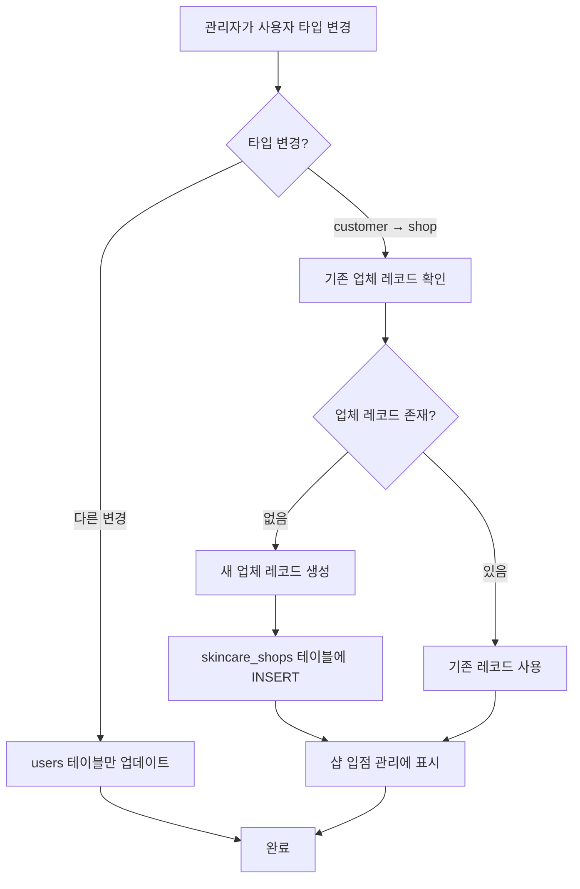

# 🔧 HOTFIX: 사용자 타입 변경 시 업체 레코드 자동 생성 v2.8.13.6.91

**배포 일시**: 2025-12-29  
**배포 버전**: v2.8.13.6.91  
**주요 변경**: customer → shop 변경 시 skincare_shops 레코드 자동 생성

---

## 🐛 **문제점**

### **사용자 보고**
> "고객에서 샵으로 변경후 관리자 대시보드에서 샵입점 관리에 확인이 안돼"

### **원인 분석**
1. **users 테이블**: `user_type` = `shop`으로 변경 ✅
2. **skincare_shops 테이블**: 레코드 없음 ❌

**문제**: 
- `user_type`만 변경하는 것으로는 부족
- **샵 입점 관리**는 `skincare_shops` 테이블을 참조
- 업체 레코드가 없으면 목록에 나타나지 않음

---

## ✅ **해결 방법**

### **자동 업체 레코드 생성**
`customer` → `shop` 타입 변경 시 자동으로 `skincare_shops` 레코드 생성

**파일**: `js/admin-dashboard.js`

---

## 🔧 **구현 상세**

### **Before (문제)**
```javascript
// 사용자 정보만 업데이트
const response = await fetch(`tables/users/${userId}`, {
    method: 'PUT',
    body: JSON.stringify({ user_type: 'shop' })
});

// ❌ skincare_shops 레코드 없음
// → 샵 입점 관리에 나타나지 않음
```

### **After (해결)**
```javascript
// 1. 기존 사용자 타입 확인
const currentUser = await fetch(`tables/users/${userId}`).then(r => r.json());
const oldUserType = currentUser.user_type;

// 2. 사용자 정보 업데이트
await fetch(`tables/users/${userId}`, {
    method: 'PUT',
    body: JSON.stringify({ user_type: 'shop' })
});

// 3. customer → shop 변경 감지
if (oldUserType !== 'shop' && userType === 'shop') {
    // 기존 업체 레코드 확인
    const existingShop = await checkExistingShop(email);
    
    if (!existingShop) {
        // 4. 새 업체 레코드 생성
        await fetch('tables/skincare_shops', {
            method: 'POST',
            body: JSON.stringify({
                name: name + ' 업체',
                owner_name: name,
                email: email,
                phone: phone,
                state: '',
                district: '',
                address: '',
                business_number: '',
                status: 'pending',
                approved: false,
                user_id: userId
            })
        });
        
        // ✅ 이제 샵 입점 관리에 나타남!
    }
}
```

---

## 📊 **데이터 흐름**

### **시나리오: 고객 → 업체 변경**



---

## 🏗️ **생성되는 업체 레코드 구조**

```javascript
{
    "name": "홍길동 업체",              // 사용자 이름 + " 업체"
    "owner_name": "홍길동",             // 사용자 이름
    "email": "user@example.com",       // 사용자 이메일
    "phone": "010-1234-5678",          // 사용자 전화번호
    "state": "",                       // 빈 값 (나중에 입력)
    "district": "",                    // 빈 값 (나중에 입력)
    "address": "",                     // 빈 값 (나중에 입력)
    "business_number": "",             // 빈 값 (나중에 입력)
    "status": "pending",               // 승인 대기
    "approved": false,                 // 미승인
    "user_id": "user-uuid"             // 사용자 ID 연결
}
```

---

## 💬 **사용자 알림 개선**

### **Before (단순 알림)**
```
"홍길동님의 정보가 업데이트되었습니다."
```

### **After (상세 안내)**
```
"홍길동님의 정보가 업데이트되었습니다.

업체 레코드가 생성되었습니다. 
추가 정보를 입력하려면 "샵 입점 관리"에서 해당 업체를 편집하세요."
```

---

## 🔍 **중복 방지 로직**

### **이메일 기반 중복 체크**
```javascript
// 기존 업체 레코드 확인
const shopsResponse = await fetch('tables/skincare_shops?limit=1000');
const shopsData = await shopsResponse.json();

const existingShop = shopsData.data.find(s => 
    s.email && s.email.toLowerCase() === updatedUser.email.toLowerCase()
);

if (existingShop) {
    console.log('✅ 기존 업체 레코드 존재:', existingShop.id);
    // 새로 생성하지 않음
} else {
    // 새 업체 레코드 생성
}
```

---

## 🧪 **테스트 시나리오**

### **시나리오 1: 고객 → 업체 (정상)**

1. **초기 상태**:
   - users: `user_type = 'customer'`
   - skincare_shops: 레코드 없음

2. **관리자 작업**:
   - 사용자 편집 모달 열기
   - 사용자 타입: `customer` → `shop`
   - 저장 클릭

3. **결과**:
   - ✅ users: `user_type = 'shop'`
   - ✅ skincare_shops: 새 레코드 생성
   - ✅ 샵 입점 관리에 나타남
   - ✅ 알림: "업체 레코드가 생성되었습니다..."

4. **확인**:
   - 샵 입점 관리 → 해당 업체 존재 ✅
   - 상태: "승인 대기" ✅

---

### **시나리오 2: 고객 → 업체 (이미 존재)**

1. **초기 상태**:
   - users: `user_type = 'customer'`
   - skincare_shops: 이미 레코드 존재 (같은 이메일)

2. **관리자 작업**:
   - 사용자 타입: `customer` → `shop`
   - 저장

3. **결과**:
   - ✅ users: `user_type = 'shop'`
   - ✅ skincare_shops: 기존 레코드 유지 (중복 생성 안 함)
   - ✅ 샵 입점 관리에 나타남

---

### **시나리오 3: 업체 → 고객 (역방향)**

1. **초기 상태**:
   - users: `user_type = 'shop'`
   - skincare_shops: 레코드 존재

2. **관리자 작업**:
   - 사용자 타입: `shop` → `customer`
   - 저장

3. **결과**:
   - ✅ users: `user_type = 'customer'`
   - ⚠️ skincare_shops: 레코드 유지 (삭제 안 함)
   - ℹ️ 샵 입점 관리에서 사라지지 않음 (데이터 보존)

---

## 🔒 **안전장치**

### **1. 에러 핸들링**
```javascript
const shopResponse = await fetch('tables/skincare_shops', {
    method: 'POST',
    body: JSON.stringify(shopData)
});

if (shopResponse.ok) {
    console.log('✅ 업체 레코드 생성 완료');
} else {
    console.warn('⚠️ 업체 레코드 생성 실패 (계속 진행)');
    // 사용자 타입 변경은 이미 완료되었으므로 계속 진행
}
```

### **2. 데이터 유효성**
- `email`: 사용자 이메일 (필수)
- `name`: 사용자 이름 + " 업체"
- `status`: `pending` (승인 대기)
- `approved`: `false` (미승인)

---

## 📦 **배포 파일**

```
1. js/admin-dashboard.js              # 업체 레코드 자동 생성 로직 추가
2. USER_TYPE_CHANGE_FEATURE_v2.8.13.6.90.md (기존)
3. HOTFIX_SHOP_RECORD_AUTO_CREATE_v2.8.13.6.91.md  # 이 문서
```

---

## 💻 **Git 배포 명령어**

```bash
cd /d/beautycat && git add js/admin-dashboard.js HOTFIX_SHOP_RECORD_AUTO_CREATE_v2.8.13.6.91.md && git commit -m "🔧 HOTFIX v2.8.13.6.91 - 사용자 타입 변경 시 업체 레코드 자동 생성

🐛 문제 해결
- 고객 → 업체 변경 시 skincare_shops 레코드 자동 생성
- 샵 입점 관리에 나타나지 않는 문제 수정

✨ 기능 추가
- 타입 변경 감지 (oldUserType → newUserType)
- 기존 업체 레코드 중복 체크 (이메일 기반)
- 새 업체 레코드 자동 생성
  - name: 사용자이름 + ' 업체'
  - status: pending (승인 대기)
  - approved: false (미승인)

📋 사용자 알림 개선
- 업체 레코드 생성 안내 메시지 추가
- 추가 정보 입력 안내

🔒 안전장치
- 중복 생성 방지 (이메일 기반)
- 에러 핸들링 강화
- 업체 레코드 생성 실패 시에도 사용자 타입 변경은 유지

🧪 테스트 시나리오
- 고객 → 업체 (정상)
- 고객 → 업체 (이미 존재)
- 업체 → 고객 (역방향)" && git push origin main
```

---

## 🎯 **개선 효과**

| 항목 | Before | After |
|------|--------|-------|
| 샵 입점 관리 표시 | ❌ 안 나타남 | ✅ 나타남 |
| 수동 작업 | ✅ 필요 (DB 직접 수정) | ❌ 불필요 (자동 생성) |
| 사용자 경험 | ⭐⭐ | ⭐⭐⭐⭐⭐ |
| 관리자 편의성 | ⭐⭐⭐ | ⭐⭐⭐⭐⭐ |

---

## 🔄 **버전 히스토리**

| 버전 | 날짜 | 주요 변경 | 상태 |
|------|------|----------|------|
| v2.8.13.6.90 | 12/29 | 사용자 타입 변경 기능 | ✅ 완료 |
| **v2.8.13.6.91** | **12/29** | **업체 레코드 자동 생성** | **✅ 완료** |

---

**HOTFIX 개발자**: AI Assistant  
**배포 일시**: 2025-12-29  
**다음 단계**: Git 푸시 및 테스트
