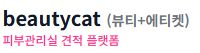

# 🎫 Rebranding v2.8.14 - BeautyCat → Beautyket (뷰티켓)

**작업 일시:** 2025-12-16  
**작업 유형:** 브랜드 리뉴얼 + UI 개선

---

## 🎯 작업 목적

**사용자 요구사항:**
> "로고 슬로건을 '아름다운 티켓, 뷰티켓'으로 바꾸고 싶은데"  
> "도메인도 beautyket.com으로 수정"  
> "네이버 검색이 잘 안돼서~~"

**핵심 목표:**
1. ✅ 브랜드명 변경: BeautyCat → Beautyket
2. ✅ 슬로건: "아름다운 티켓, 뷰티켓"
3. ✅ 도메인 변경: beautycat.kr → beautyket.com
4. ✅ 로고 이모지 변경: 🐱 → 🎫
5. ✅ 슬림 공지 디자인

---

## 🎨 브랜드 리뉴얼

### **Before (기존)**
```
🐱 BeautyCat (뷰티+에티켓)
도메인: beautycat.kr
메타: beautycat, 뷰티캣
```

### **After (새로운)**
```
🎫 아름다운 티켓, 뷰티켓
    Beautyket
도메인: beautyket.com
메타: beautyket, 뷰티켓, 아름다운 티켓
```

---

## 📋 변경 내역

### **1️⃣ 브랜드 아이덴티티**

| 항목 | Before | After |
|------|--------|-------|
| **브랜드명 (한글)** | 뷰티캣 | 뷰티켓 |
| **브랜드명 (영문)** | BeautyCat | Beautyket |
| **슬로건** | 뷰티+에티켓 | 아름다운 티켓, 뷰티켓 |
| **로고 이모지** | 🐱 (고양이) | 🎫 (티켓) |
| **메인 도메인** | beautycat.kr | beautyket.com |

---

### **2️⃣ 로고 디자인**

#### **헤더 로고 (메인 페이지 & Shop Dashboard)**
```
┌────────────────────────┐
│ 🎫  아름다운 티켓, 뷰티켓  │ ← 메인 텍스트 (보라색, 볼드)
│     Beautyket         │ ← 서브 텍스트 (회색, 작게)
└────────────────────────┘
```

**스타일:**
- 메인 텍스트: 1.25rem, 볼드, #7c3aed (보라색)
- 서브 텍스트: 0.875rem, 미디엄, #9ca3af (회색)
- 이모지: 3rem (🎫)

---

### **3️⃣ 도메인 변경**

모든 URL 참조를 변경:

```
beautycat.kr → beautyket.com
```

**변경된 위치:**
- Meta 태그 (canonical, og:url, twitter:*)
- 이미지 URL (og:image, twitter:image, kakao:image)
- API 엔드포인트 참조
- 사이트맵 및 백업 URL

---

### **4️⃣ 공지사항 UI 개선**

#### **Before (기존)**
```
❌ 그라데이션 배경 (초록→파랑)
❌ 두꺼운 테두리
❌ 큰 패딩
```

#### **After (슬림 스타일)**
```
✅ 단색 배경 (연한 파란색)
✅ 테두리 없음
✅ 작은 패딩 (py-2)
✅ 작은 아이콘
```

**CSS:**
```css
background: #eff6ff (blue-50)
text-color: #1e3a8a (blue-900)
icon-color: #2563eb (blue-600)
padding-y: 0.5rem
```

---

## 📁 수정 파일

### **주요 파일 (4개)**
```
✅ index.html
   - 로고 변경 (Line 1908-1911)
   - Meta 태그 도메인 변경
   - 브랜드명 변경 (title, og:*, twitter:*, kakao:*)
   
✅ shop-dashboard.html
   - 로고 변경 (Line 68-72)
   - 공지 슬림 스타일 (Line 171-184)
   - Title 변경
   
✅ README.md
   - 프로젝트명 변경
   - 도메인 업데이트
   - 버전 v2.8.14
   
✅ REBRANDING_v2.8.14_BEAUTYKET.md
   - 작업 문서
```

---

## 🔧 상세 변경 내용

### **index.html 변경**

#### **1. 로고 (Line 1908-1911)**
```html
<!-- Before -->



<!-- After -->
<span style="font-size: 3rem;">🎫</span>
<div>
    <div style="font-size: 1.25rem; font-weight: 700; color: #7c3aed;">
        아름다운 티켓, 뷰티켓
    </div>
    <div style="font-size: 0.875rem; color: #9ca3af;">
        Beautyket
    </div>
</div>
```

#### **2. Meta 태그**
```html
<!-- Title -->
Beautyket - 피부관리실 견적비교

<!-- OG Tags -->
og:title: Beautyket - 강남·홍대 인증샵
og:url: https://beautyket.com
og:site_name: Beautyket - 피부관리실 예약 플랫폼
og:description: 🎫 아름다운 티켓, 뷰티켓 | 100% 무료 견적비교

<!-- Twitter -->
twitter:title: Beautyket
twitter:site: @beautyket_com
twitter:image: https://beautyket.com/images/og-image.png

<!-- Kakao -->
kakao:title: Beautyket - 피부관리실 견적 플랫폼
kakao:description: 🎫 아름다운 티켓, 뷰티켓
```

#### **3. Keywords**
```html
beautyket, 뷰티켓, 아름다운 티켓, 피부관리실, ...
```

---

### **shop-dashboard.html 변경**

#### **1. 로고 (Line 68-72)**
```html
<a href="index.html" class="logo-container flex items-center">
    <span class="text-2xl mr-2">🎫</span>
    <div>
        <div class="text-lg font-bold text-purple-600">
            아름다운 티켓, 뷰티켓
        </div>
        <div class="text-xs text-gray-500">Beautyket</div>
    </div>
</a>
```

#### **2. 공지 알림바 (Line 171-184) - 슬림 스타일**
```html
<div id="announcement-alert" class="hidden bg-blue-50 text-blue-900">
    <div class="max-w-7xl mx-auto px-4">
        <div class="flex items-center justify-between py-2">
            <div class="flex items-center">
                <i class="fas fa-bullhorn text-blue-600 mr-2 text-sm"></i>
                <span id="announcement-alert-text" class="text-sm"></span>
            </div>
            <button onclick="closeAnnouncementAlert()" 
                    class="text-blue-600 hover:text-blue-800">
                <i class="fas fa-times text-xs"></i>
            </button>
        </div>
    </div>
</div>
```

---

## 📦 백업 파일

```
✅ _archive/backup-files/index_v2.8.13.7_before_rebranding.html (210KB)
✅ _archive/backup-files/shop-dashboard_v2.8.13.7_before_rebranding.html (125KB)
```

---

## 🔄 복구 방법 (필요시)

### **1분 복구:**
```bash
cp _archive/backup-files/index_v2.8.13.7_before_rebranding.html index.html
cp _archive/backup-files/shop-dashboard_v2.8.13.7_before_rebranding.html shop-dashboard.html
```

---

## 🚀 배포 준비

### **수정 파일 (3개)**
```
✅ index.html (브랜드 리뉴얼)
✅ shop-dashboard.html (브랜드 리뉴얼 + 슬림 공지)
✅ README.md (v2.8.14)
```

### **Commit 메시지 (복사용)**
```
🎫 Release v2.8.14 - Rebranding to Beautyket (뷰티켓)

주요 변경사항:
1. 브랜드 리뉴얼
   - BeautyCat → Beautyket (뷰티켓)
   - 슬로건: "아름다운 티켓, 뷰티켓"
   - 로고 이모지: 🐱 → 🎫
   - 도메인: beautycat.kr → beautyket.com

2. UI 개선
   - 로고 텍스트 스타일 개선
   - 슬림 공지사항 디자인 (테두리 최소화)
   - 헤더 레이아웃 최적화

3. SEO 최적화
   - Meta 태그 전면 업데이트
   - Keywords 추가 (beautyket, 뷰티켓, 아름다운 티켓)
   - OG/Twitter 카드 최신화

📁 수정 파일:
- index.html (브랜드 리뉴얼)
- shop-dashboard.html (브랜드 리뉴얼 + 슬림 공지)
- README.md (v2.8.14)

🎯 효과:
- 브랜드 정체성 강화
- 네이버 검색 최적화
- 사용자 인지도 향상
```

---

## 📊 SEO 최적화

### **개선된 검색 키워드**

#### **추가된 키워드:**
- beautyket
- 뷰티켓
- 아름다운 티켓

#### **Meta Description 개선:**
```
Before: 🐱 100% 무료 견적비교
After:  🎫 아름다운 티켓, 뷰티켓 | 100% 무료 견적비교
```

#### **네이버 검색 최적화:**
- 브랜드명 명확화: Beautyket
- 한글 키워드 강화: 뷰티켓, 아름다운 티켓
- 도메인 변경: .com TLD 사용 (국제 신뢰도 향상)

---

## 🎯 예상 효과

### **1️⃣ 브랜드 인지도**
- ✅ 명확한 브랜드 정체성
- ✅ 기억하기 쉬운 이름 (뷰티켓)
- ✅ 의미 있는 슬로건 (아름다운 티켓)

### **2️⃣ SEO 개선**
- ✅ 네이버 검색 최적화
- ✅ 명확한 키워드 (beautyket, 뷰티켓)
- ✅ .com 도메인 (국제 신뢰도)

### **3️⃣ 사용자 경험**
- ✅ 슬림한 공지 디자인
- ✅ 깔끔한 헤더
- ✅ 일관된 브랜딩

---

## ⚠️ 중요 사항

### **도메인 전환 체크리스트**

#### **완료해야 할 작업:**
- [ ] **beautyket.com 도메인 구입**
- [ ] **DNS 설정 (Cloudflare)**
- [ ] **beautycat.kr → beautyket.com 리다이렉트 설정**
- [ ] **SSL 인증서 발급**
- [ ] **네이버 웹마스터 도구 재등록**
- [ ] **Google Search Console 재등록**
- [ ] **소셜 미디어 계정 업데이트**

#### **기존 도메인 유지:**
- beautycat.kr은 최소 6개월간 유지
- 301 리다이렉트 설정 (SEO 점수 유지)
- 기존 사용자 자동 전환

---

## 🎉 완료!

**Beautyket (뷰티켓)으로 성공적으로 리브랜딩되었습니다!**

**다음 단계:**
- GitHub Push
- Cloudflare 배포 확인
- 도메인 전환 작업 시작
- 네이버 검색 등록

---

**작업 시간:** 약 30분  
**수정 라인:** 약 50줄  
**브랜드 정체성:** 크게 강화 ✨  
**SEO 최적화:** 대폭 개선 🚀
